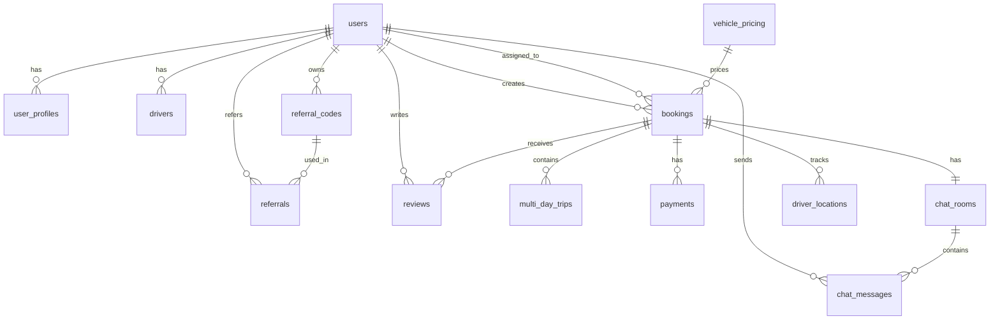

# 資料庫設計文檔

包車/接送叫車服務資料庫設計總覽

## 資料庫資訊

- **資料庫類型**: PostgreSQL 15+
- **字元編碼**: UTF-8
- **時區**: UTC
- **擴展**: PostGIS (地理位置), uuid-ossp (UUID 生成)

## 資料表總覽

### 用戶管理
- `users` - 用戶基本資料
- `user_profiles` - 用戶詳細資料
- `drivers` - 司機專用資料

### 業務核心
- `bookings` - 預約訂單
- `multi_day_trips` - 多日行程
- `vehicle_pricing` - 車型價格

### 支付系統
- `payments` - 支付記錄

### 即時功能
- `driver_locations` - 司機位置追蹤
- `chat_rooms` - 聊天室
- `chat_messages` - 聊天訊息

### 推薦系統
- `referral_codes` - 推薦碼
- `referrals` - 推薦記錄

### 評價系統
- `reviews` - 評價記錄

### 系統管理
- `system_settings` - 系統設定

## 資料表關聯圖



## 核心資料表結構

### users (用戶表)
```sql
CREATE TABLE users (
    id UUID PRIMARY KEY DEFAULT uuid_generate_v4(),
    firebase_uid VARCHAR(128) UNIQUE NOT NULL,
    email VARCHAR(255) UNIQUE NOT NULL,
    phone VARCHAR(20),
    role VARCHAR(20) NOT NULL CHECK (role IN ('customer', 'driver', 'admin')),
    status VARCHAR(20) NOT NULL DEFAULT 'active',
    preferred_language VARCHAR(10) DEFAULT 'zh-TW',
    created_at TIMESTAMP WITH TIME ZONE DEFAULT NOW(),
    updated_at TIMESTAMP WITH TIME ZONE DEFAULT NOW()
);
```

### bookings (預約訂單表)
```sql
CREATE TABLE bookings (
    id UUID PRIMARY KEY DEFAULT uuid_generate_v4(),
    customer_id UUID NOT NULL REFERENCES users(id),
    driver_id UUID REFERENCES users(id),
    booking_number VARCHAR(20) UNIQUE NOT NULL,
    status VARCHAR(20) NOT NULL DEFAULT 'pending',
    
    -- 預約詳情
    start_date DATE NOT NULL,
    start_time TIME NOT NULL,
    duration_hours INTEGER NOT NULL CHECK (duration_hours IN (6, 8)),
    vehicle_type VARCHAR(10) NOT NULL CHECK (vehicle_type IN ('A', 'B', 'C', 'D')),
    pickup_location TEXT NOT NULL,
    pickup_latitude DECIMAL(10, 8),
    pickup_longitude DECIMAL(11, 8),
    
    -- 價格計算
    base_price DECIMAL(10,2) NOT NULL,
    total_amount DECIMAL(10,2) NOT NULL,
    deposit_amount DECIMAL(10,2) NOT NULL,
    
    created_at TIMESTAMP WITH TIME ZONE DEFAULT NOW(),
    updated_at TIMESTAMP WITH TIME ZONE DEFAULT NOW()
);
```

## 索引策略

### 主要索引
```sql
-- 用戶相關索引
CREATE INDEX idx_users_firebase_uid ON users(firebase_uid);
CREATE INDEX idx_users_email ON users(email);
CREATE INDEX idx_users_role ON users(role);

-- 預約相關索引
CREATE INDEX idx_bookings_customer_id ON bookings(customer_id);
CREATE INDEX idx_bookings_driver_id ON bookings(driver_id);
CREATE INDEX idx_bookings_status ON bookings(status);
CREATE INDEX idx_bookings_start_date ON bookings(start_date);

-- 位置相關索引
CREATE INDEX idx_driver_locations_driver_id ON driver_locations(driver_id);
CREATE INDEX idx_driver_locations_recorded_at ON driver_locations(recorded_at);

-- 聊天相關索引
CREATE INDEX idx_chat_messages_room_id ON chat_messages(room_id);
CREATE INDEX idx_chat_messages_sent_at ON chat_messages(sent_at);
```

### 複合索引
```sql
-- 預約查詢優化
CREATE INDEX idx_bookings_customer_status_date ON bookings(customer_id, status, start_date);
CREATE INDEX idx_bookings_driver_status_date ON bookings(driver_id, status, start_date);

-- 位置查詢優化
CREATE INDEX idx_driver_locations_booking_time ON driver_locations(booking_id, recorded_at);
```

## 資料完整性約束

### 外鍵約束
- 所有 `user_id` 欄位都參照 `users.id`
- 所有 `booking_id` 欄位都參照 `bookings.id`
- 支付記錄必須關聯到有效的預約

### 檢查約束
- 車型只能是 A, B, C, D
- 預約時數只能是 6 或 8 小時
- 評分只能是 1-5 星
- 金額不能為負數

### 唯一約束
- 用戶 email 唯一
- 司機車牌號碼唯一
- 預約編號唯一
- 推薦碼唯一

## 觸發器

### 自動更新時間戳
```sql
CREATE OR REPLACE FUNCTION update_updated_at_column()
RETURNS TRIGGER AS $$
BEGIN
    NEW.updated_at = NOW();
    RETURN NEW;
END;
$$ language 'plpgsql';

-- 為需要的表創建觸發器
CREATE TRIGGER update_users_updated_at 
    BEFORE UPDATE ON users 
    FOR EACH ROW EXECUTE FUNCTION update_updated_at_column();
```

## 資料保留政策

### 短期保留 (7-30 天)
- 司機位置記錄
- 系統日誌

### 中期保留 (60-90 天)
- 聊天記錄
- 臨時檔案

### 長期保留 (1-7 年)
- 用戶資料
- 預約記錄
- 支付記錄
- 評價記錄

### 永久保留
- 財務記錄
- 法規要求資料

## 備份策略

### 每日備份
- 完整資料庫備份
- 保留 30 天

### 每週備份
- 完整資料庫備份
- 保留 12 週

### 每月備份
- 完整資料庫備份
- 保留 12 個月

### 年度備份
- 完整資料庫備份
- 永久保留

## 效能優化

### 查詢優化
- 使用適當的索引
- 避免 N+1 查詢問題
- 使用連接池

### 資料分割
- 按時間分割大表 (如位置記錄)
- 按地區分割 (如需要)

### 快取策略
- Redis 快取熱門資料
- 應用層快取查詢結果

## 安全性

### 資料加密
- 敏感資料欄位加密
- 傳輸層加密 (TLS)

### 存取控制
- 角色基礎存取控制 (RBAC)
- 行級安全性 (RLS)

### 稽核日誌
- 記錄所有資料變更
- 定期稽核存取日誌

## 監控指標

### 效能指標
- 查詢回應時間
- 連接數使用率
- 快取命中率

### 容量指標
- 資料庫大小
- 表格大小
- 索引大小

### 可用性指標
- 資料庫可用時間
- 備份成功率
- 復原測試結果

## 維護作業

### 日常維護
- 監控系統狀態
- 檢查備份狀態
- 清理過期資料

### 週期維護
- 重建索引
- 更新統計資訊
- 檢查資料完整性

### 緊急維護
- 故障恢復程序
- 資料修復程序
- 效能調優

---

更多詳細資訊請參考：

- [資料表結構](./schema.md)
- [資料表關聯](./relationships.md)
- [資料庫遷移](./migrations.md)
- [效能調優](./performance.md)
- [備份恢復](./backup-restore.md)
