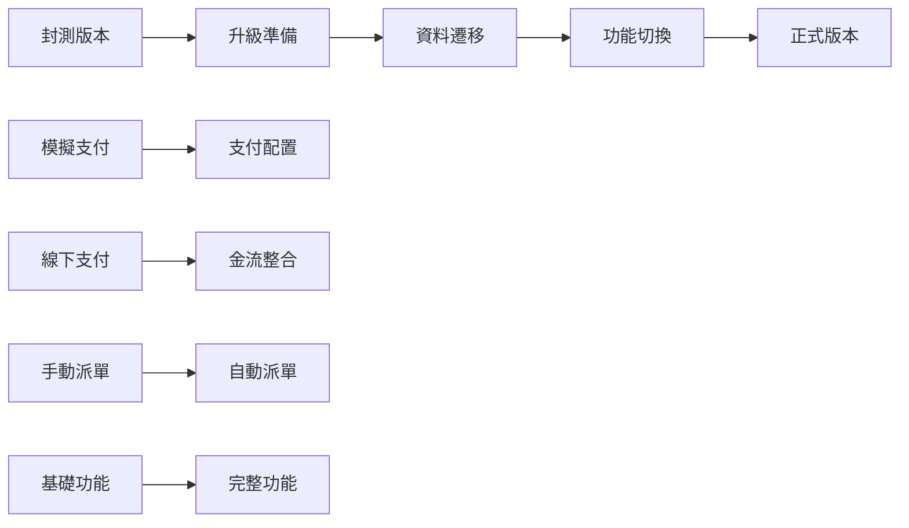

# 升級路徑規劃：從封測到正式版

**目標**: 確保從封測階段平滑升級到正式版本，不影響既有功能和資料

## 升級策略總覽

### 階段一：封測版本 → 階段二：正式版本



## 1. 支付系統升級

### 1.1 支付策略切換

#### 當前狀態 (封測)
```typescript
// 封測階段配置
const betaConfig = {
  provider: PaymentProviderType.MOCK,
  isTestMode: true,
  config: {
    successRate: 0.9,
    processingDelay: 2000
  }
};
```

#### 目標狀態 (正式)
```typescript
// 正式版配置
const productionConfig = {
  provider: PaymentProviderType.CREDIT_CARD,
  isTestMode: false,
  config: {
    merchantId: "real_merchant_id",
    apiKey: "real_api_key",
    webhookSecret: "real_webhook_secret"
  }
};
```

### 1.2 資料遷移策略

#### 支付記錄遷移
```sql
-- 1. 標記測試資料
UPDATE payments 
SET is_test_mode = true 
WHERE payment_provider IN ('mock', 'offline');

-- 2. 保留重要的測試交易作為範例
UPDATE payments 
SET admin_notes = 'Beta test transaction - kept for reference'
WHERE payment_provider = 'mock' 
AND status = 'completed'
AND created_at >= '2025-01-01';

-- 3. 清理過期的測試資料 (可選)
DELETE FROM payments 
WHERE payment_provider = 'mock' 
AND status IN ('failed', 'expired')
AND created_at < NOW() - INTERVAL '30 days';
```

#### 用戶資料處理
```sql
-- 將測試用戶標記為正式用戶
UPDATE users 
SET status = 'active'
WHERE status = 'pending' 
AND created_at >= '2025-01-01';
```

### 1.3 漸進式升級流程

#### Step 1: 準備階段
1. **部署新的支付提供者**
   ```bash
   # 部署包含真實金流的新版本
   npm run build
   npm run deploy:staging
   ```

2. **配置環境變數**
   ```bash
   # 設定生產環境的支付配置
   export PAYMENT_PROVIDER=credit_card
   export PAYMENT_TEST_MODE=false
   export CREDIT_CARD_MERCHANT_ID=your_merchant_id
   ```

3. **驗證配置**
   ```typescript
   const validation = paymentConfig.validateConfig();
   if (!validation.isValid) {
     throw new Error(`Config validation failed: ${validation.errors.join(', ')}`);
   }
   ```

#### Step 2: 測試階段
1. **沙盒環境測試**
   - 使用真實金流的測試環境
   - 驗證完整支付流程
   - 測試退款功能

2. **小規模用戶測試**
   - 選擇部分用戶進行真實支付測試
   - 監控支付成功率和錯誤率
   - 收集用戶回饋

#### Step 3: 切換階段
1. **功能開關切換**
   ```typescript
   // 透過後台管理介面或 API 切換
   await paymentConfig.switchToProductionMode(PaymentProviderType.CREDIT_CARD);
   ```

2. **監控關鍵指標**
   - 支付成功率 > 95%
   - API 回應時間 < 3 秒
   - 錯誤率 < 1%

#### Step 4: 完成階段
1. **清理測試資料** (可選)
2. **更新文檔**
3. **通知用戶**

## 2. 功能升級路徑

### 2.1 自動派單系統

#### 升級步驟
1. **保留手動派單**作為備用方案
2. **逐步啟用自動派單**
   ```typescript
   const dispatchConfig = {
     autoDispatchEnabled: true,
     fallbackToManual: true,
     autoDispatchRadius: 10, // 10km 範圍內自動派單
     maxRetryAttempts: 3
   };
   ```

3. **監控派單效果**
   - 派單成功率
   - 平均派單時間
   - 司機接單率

### 2.2 即時翻譯功能

#### 升級步驟
1. **整合 GPT-4o mini API**
2. **逐步開放語言支援**
   - 第一批：中文、英文、日文
   - 第二批：韓文、越南文、泰文
   - 第三批：其他語言

3. **效能優化**
   - 翻譯結果快取
   - 批次翻譯處理
   - 錯誤重試機制

### 2.3 進階報表功能

#### 升級步驟
1. **資料收集優化**
2. **報表模板建立**
3. **即時資料處理**
4. **匯出功能**

## 3. 資料相容性保證

### 3.1 資料庫結構
- ✅ **向下相容**: 新結構支援舊資料
- ✅ **欄位擴展**: 新增欄位有預設值
- ✅ **索引優化**: 不影響既有查詢

### 3.2 API 相容性
- ✅ **版本控制**: API v1 保持不變
- ✅ **新增端點**: 不影響既有端點
- ✅ **回應格式**: 保持一致的資料結構

### 3.3 前端相容性
- ✅ **漸進式升級**: 功能逐步開放
- ✅ **向下相容**: 舊版本仍可使用
- ✅ **用戶體驗**: 升級過程對用戶透明

## 4. 風險控制

### 4.1 技術風險

#### 支付系統風險
- **風險**: 真實金流整合可能出現問題
- **控制**: 
  - 充分的沙盒測試
  - 小規模用戶測試
  - 快速回滾機制

#### 資料遷移風險
- **風險**: 資料遷移可能導致資料遺失
- **控制**:
  - 完整資料備份
  - 分階段遷移
  - 驗證機制

### 4.2 業務風險

#### 用戶體驗風險
- **風險**: 升級過程可能影響用戶體驗
- **控制**:
  - 升級通知
  - 客服支援
  - 快速問題解決

#### 營運風險
- **風險**: 新功能可能影響營運效率
- **控制**:
  - 員工培訓
  - 操作手冊更新
  - 監控機制

## 5. 升級檢查清單

### 5.1 技術準備
- [ ] 支付提供者整合完成
- [ ] 沙盒環境測試通過
- [ ] 資料庫備份完成
- [ ] 監控系統就緒
- [ ] 回滾方案準備

### 5.2 業務準備
- [ ] 用戶通知發送
- [ ] 客服團隊培訓
- [ ] 操作手冊更新
- [ ] 緊急聯絡人確認

### 5.3 升級執行
- [ ] 維護視窗安排
- [ ] 升級腳本執行
- [ ] 功能驗證測試
- [ ] 監控指標檢查
- [ ] 用戶通知更新

### 5.4 升級後驗證
- [ ] 支付流程測試
- [ ] 核心功能驗證
- [ ] 效能指標檢查
- [ ] 用戶回饋收集
- [ ] 問題追蹤處理

## 6. 回滾策略

### 6.1 快速回滾
```bash
# 緊急回滾到封測版本
export PAYMENT_PROVIDER=mock
export PAYMENT_TEST_MODE=true
pm2 restart all
```

### 6.2 資料回滾
```sql
-- 恢復支付配置到封測狀態
UPDATE system_settings 
SET value = '"mock"' 
WHERE key = 'payment.default_provider';
```

### 6.3 功能回滾
```typescript
// 透過功能開關快速關閉新功能
const featureFlags = {
  realPayment: false,
  autoDispatch: false,
  realTimeTranslation: false
};
```

## 7. 成功指標

### 7.1 技術指標
- 支付成功率 > 95%
- API 回應時間 < 3 秒
- 系統可用性 > 99.5%
- 零重大 Bug

### 7.2 業務指標
- 用戶滿意度 > 4.0/5.0
- 客服工單減少 < 10%
- 營運效率提升 > 20%

### 7.3 財務指標
- 支付手續費控制在預算內
- 退款率 < 2%
- 收入增長 > 15%

---

**更新日期**: 2025-01-27  
**負責人**: 開發團隊  
**審核人**: 產品經理、技術總監
